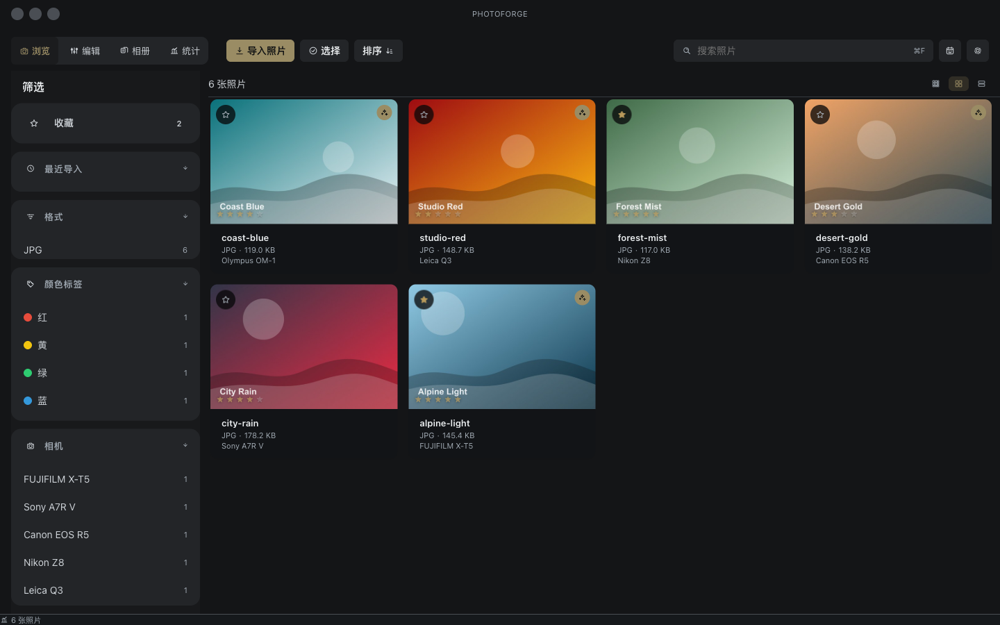
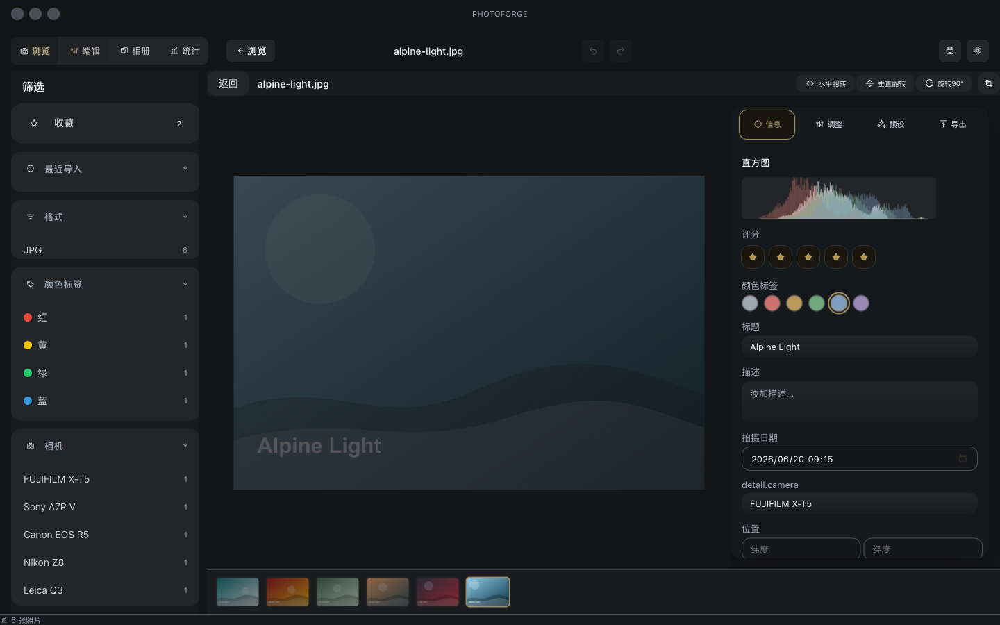
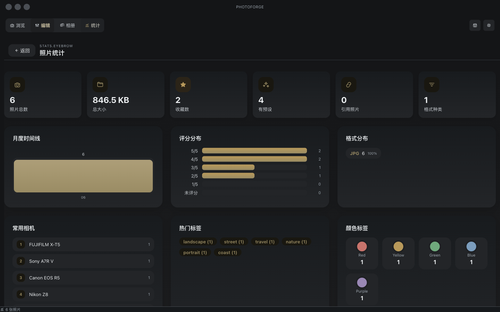
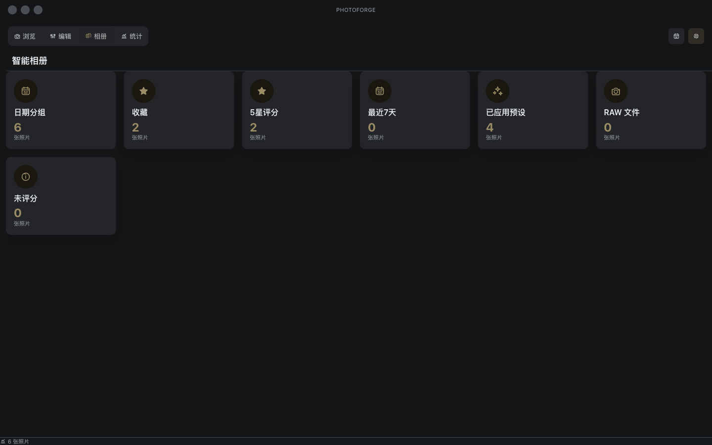
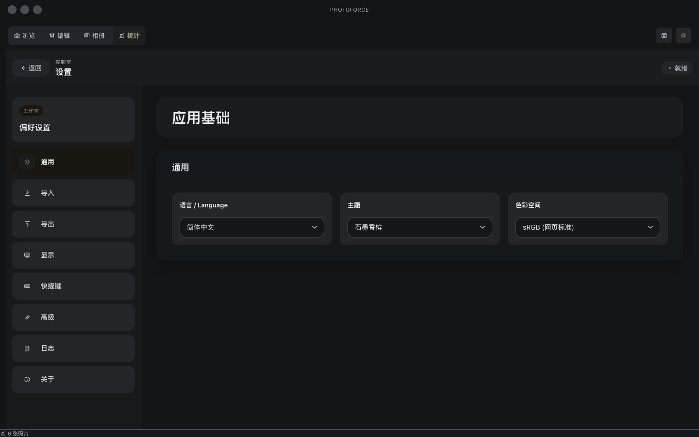

# PhotoForge 📷

> 专业照片管理与预设滤镜编辑器 — 支持 RAW 格式、批量处理、一键预设

PhotoForge 是一款 macOS 桌面应用，专为摄影师和修图师设计。它提供从照片导入、浏览筛选、预设编辑到批量导出的完整工作流，支持主流相机 RAW 格式，内置 36 款专业预设。

---

## 项目截图

### 照片浏览



### 单张编辑



### 统计概览



### 智能相册



### 偏好设置



---

## ✨ 功能特性

### 📂 照片管理
- **导入** — 支持复制导入 / 引用导入双模式，自动生成缩略图
- **浏览** — 照片网格、按日期分组、单张详情、并排对比
- **筛选** — 按格式、标签、相机、评级、颜色标签、收藏等多维筛选
- **搜索** — 全局搜索（跨文件名、相机型号、标签等 7 个字段）
- **排序** — 6 种排序字段（日期/文件名/大小/评级/格式/相机）
- **批量操作** — 批量预设应用、批量导出、批量删除
- **相册** — 创建/编辑相册 + 智能相册（条件自动填充）
- **收藏标记** — ⭐ 收藏 + 按收藏筛选

### 🎨 预设滤镜系统
- **36 款内置预设** — 涵盖经典/电影/黑白/复古/人像/风景/美食/胶片/日系 9 大类
- **一键应用** — 单击预设即可预览效果
- **实时预览** — CSS filter + SVG 滤镜双重渲染引擎，预设效果即时可见
- **参数微调** — 16 项调整参数：曝光/亮度/对比度/高光/阴影/白色/黑色/饱和度/色温/色调/清晰度/锐度/暗角/颗粒/色相/Gamma
- **自定义预设** — 基于当前调整创建并保存自定义预设
- **预设搜索与收藏** — 按名称搜索预设，收藏常用预设
- **预设导入/导出** — 与他人分享预设文件

### 🖼️ 图像处理
- **RAW 格式支持** — 自动识别并转换主流相机 RAW 文件（CR2/NEF/ARW/RAF/DNG 等）
- **CSS 滤镜实时渲染** — 调整参数即时反馈，无需等待
- **高级 SVG 滤镜** — 色调曲线（单调三次 Hermite 插值）、色温/色调精细控制
- **暗角与颗粒** — 模拟胶片质感
- **裁切与变换** — 非破坏性裁切、翻转、旋转
- **直方图** — 实时 RGB 直方图显示

### 📤 导出
- **批量导出** — 支持 JPEG/PNG/WebP/TIFF 格式
- **自定义命名规则** — 模板化文件名（序号/日期/原始文件名组合）
- **质量/色彩空间控制** — 可调压缩质量，sRGB/Adobe RGB/P3 色彩空间
- **EXIF 保留选项** — 可选择保留或移除元数据
- **导出后打开文件夹** — 一键跳转导出目录

### 📊 统计与概览
- **统计视图** — 照片总数、存储占用、格式分布、标签统计
- **最近导入** — 快速跳转到最近导入的批次

### ⌨️ 快捷键与效率
- **全键盘操作** — ⌘I 导入 / ⌘E 导出 / ⌘1~4 切换视图 / ⌘\ 侧边栏 / ⌘P 预设面板 / ⌘L 收藏 / ⌫ 删除
- **撤销/重做** — 完整历史栈，可回退任意步骤
- **深色/浅色主题** — 自适应切换

---

## 📥 安装与使用

### 方式一：直接下载安装包（推荐）

从 [Releases](https://github.com/edisonturue/PhotoForge/releases) 页面下载最新的 `PhotoForge-mac-arm64.zip`：

1. 下载并解压
2. 将 `PhotoForge.app` 拖入「应用程序」文件夹
3. 首次打开时，macOS 可能提示"无法验证开发者"：
   - 右键点击 `PhotoForge.app` → 选择「打开」
   - 在弹出的对话框中点击「打开」
4. 之后即可正常双击启动

### 方式二：从源码构建

需要 Node.js 20+ 和 npm：

```bash
# 克隆项目
git clone https://github.com/edisonturue/PhotoForge.git
cd PhotoForge

# 安装依赖
npm install

# 开发模式运行（编译 + 启动）
npm start

# 构建为 macOS 应用
npm run build
npm run pack
```

构建后的应用位于 `release/mac-arm64/PhotoForge.app`。

### 系统要求

| 要求 | 说明 |
|------|------|
| 操作系统 | macOS 12 Monterey 或更新版本 |
| 处理器 | Apple Silicon (M1/M2/M3/M4) 或 Intel |
| 内存 | 建议 8GB 以上 |
| 存储 | 取决于照片库大小 |

---

## 🖥️ 技术栈

| 技术 | 用途 |
|------|------|
| **Electron 41** | 桌面应用框架 |
| **React 18** | UI 组件库 |
| **TypeScript** | 类型安全 |
| **Webpack 5** | 构建工具 |
| **sharp** | 高性能图像处理 |
| **exifr** | EXIF 元数据解析 |

---

## 📁 项目结构

```
PhotoForge/
├── src/
│   ├── main/          # Electron 主进程
│   │   ├── main.ts        # 主入口、IPC 处理
│   │   ├── preload.ts     # 安全桥接
│   │   ├── store.ts       # 照片数据存储
│   │   ├── importer.ts    # 照片导入
│   │   ├── rawConverter.ts # RAW 转换
│   │   ├── presetManager.ts # 预设管理
│   │   └── exportManager.ts # 导出管理
│   ├── renderer/      # 渲染进程（React）
│   │   ├── App.tsx
│   │   ├── components/    # UI 组件
│   │   ├── hooks/         # 自定义 Hooks
│   │   ├── i18n/          # 国际化（中/英）
│   │   ├── presets/       # 内置预设定义
│   │   └── styles/        # 主题系统
│   └── shared/        # 共享类型与常量
│       ├── types.ts
│       └── constants.ts
├── assets/           # 应用图标
└── release/          # 构建输出
```

---

## 🏆 核心优势

- **专业 RAW 支持** — 无需额外转换软件，直接管理相机原始文件
- **实时预览引擎** — 双渲染管线（CSS filter + SVG 滤镜），调整参数即见效果
- **36 款精心调校的预设** — 覆盖 9 大分类，一键出片
- **预设参数可微调** — 不像其他软件只能"全有或全无"，支持在预设基础上进一步调整
- **完全离线** — 无需联网，所有处理在本地完成，照片不外传
- **非破坏性编辑** — 原片永远不被修改，调整历史可随时回退
- **轻量高效** — 相比 Lightroom 占用更少资源，启动更快
- **跨格式支持** — JPEG/PNG/WebP/TIFF 以及所有主流 RAW 格式
- **中文/英文界面** — 原生支持中英文切换

---

## 🔒 隐私与安全

- 所有照片处理均在本地完成，无需联网
- 照片库存储在 `~/Pictures/PhotoForge_Library/`，与源代码完全分离
- Git 仓库仅包含源代码和资源文件，不含任何用户照片
- 无任何遥测、分析或数据收集

---

## ⚡ 快捷键速查

| 快捷键 | 功能 |
|--------|------|
| ⌘I | 导入照片 |
| ⌘E | 导出照片 |
| ⌘1 | 网格浏览 |
| ⌘2 | 照片详情 |
| ⌘3 | 对比视图 |
| ⌘4 | 相册管理 |
| ⌘\ | 切换侧边栏 |
| ⌘P | 预设面板 |
| ⌘L | 切换收藏 |
| ⌘Z | 撤销 |
| ⌘⇧Z / ⌘Y | 重做 |
| ⌫ | 删除选中 |
| ← → | 上一张/下一张 |
| ⌘A | 全选 |

---

## 🧪 测试

```bash
npm test
```

---

## 📄 许可证

本项目为开源项目，基于 MIT 许可证。
